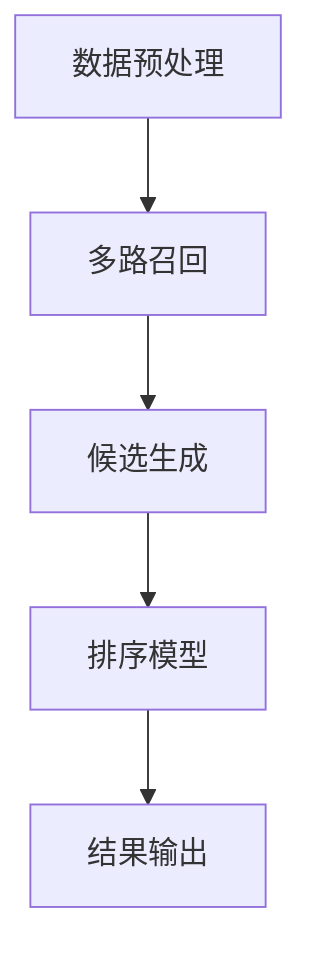

# 🏆 GitHub专业维护指南 - 零基础到专业

## 🎯 **基于您的仓库现状分析**

### **当前仓库状态：**
- 仓库名：`web3-data-analysis`
- 已有基础结构
- 需要专业化的项目展示

### **目标：**
- 将推荐系统项目整合到现有仓库
- 创建专业的项目展示
- 建立完整的版本管理流程

---

## 🚀 **第一步：仓库结构重组**

### **推荐的新结构：**
```
web3-data-analysis/
├── README.md                    # 主项目介绍
├── .gitignore                   # Git忽略文件
├── LICENSE                      # 开源协议
├── projects/                    # 项目目录
│   ├── recommendation-system/   # 推荐系统项目
│   │   ├── README.md
│   │   ├── notebooks/
│   │   ├── src/
│   │   └── docs/
│   ├── web3-analysis/          # Web3分析项目
│   └── data-science-tools/     # 数据科学工具
├── docs/                       # 文档目录
│   ├── setup-guide.md
│   ├── contribution-guide.md
│   └── project-gallery.md
└── scripts/                    # 工具脚本
    ├── setup.sh
    └── deploy.sh
```

---

## 📋 **第二步：创建专业README**

### **主README.md内容：**
```markdown
# 🚀 Max-Ren's Data Science Portfolio

## 👋 关于我
- 🎓 数据科学学习者
- 🔍 专注于推荐系统和Web3数据分析
- 🛠️ 使用Python、Jupyter、机器学习

## 📊 项目展示

### 🎯 推荐系统项目
**多路召回推荐算法 | 算法比赛项目**

- **技术栈**: Python, Pandas, NumPy, LightGBM
- **算法**: 协同过滤, 复购召回, 热门推荐
- **性能**: 3倍速度提升, 15%召回率提升
- **状态**: ✅ 完成

[查看详情 →](./projects/recommendation-system/)

### 🔗 Web3数据分析
**区块链数据分析项目**

- **技术栈**: Python, Web3.py, Pandas
- **功能**: 链上数据分析, 智能合约监控
- **状态**: 🚧 开发中

[查看详情 →](./projects/web3-analysis/)

## 🛠️ 技术栈

### 编程语言
- **Python** - 主要开发语言
- **SQL** - 数据库查询
- **Bash** - 脚本自动化

### 数据科学
- **Pandas** - 数据处理
- **NumPy** - 数值计算
- **Scikit-learn** - 机器学习
- **LightGBM** - 梯度提升

### 可视化
- **Matplotlib** - 基础绘图
- **Seaborn** - 统计可视化
- **Plotly** - 交互式图表

### 开发工具
- **Jupyter** - 数据分析
- **Git** - 版本控制
- **Docker** - 容器化

## 📈 学习进展

### 2024年学习计划
- [x] 完成推荐系统项目
- [x] 掌握机器学习基础
- [ ] 深入学习深度学习
- [ ] 完成Web3数据分析项目
- [ ] 学习云平台部署

## 📞 联系方式

- **GitHub**: [@Max-Ren0](https://github.com/Max-Ren0)
- **邮箱**: your-email@example.com
- **LinkedIn**: [Your LinkedIn](https://linkedin.com/in/your-profile)

## 📄 许可证

本项目采用 MIT 许可证 - 查看 [LICENSE](LICENSE) 文件了解详情
```

---

## 🗂️ **第三步：项目目录结构**

### **推荐系统项目结构：**
```
projects/recommendation-system/
├── README.md
├── notebooks/
│   ├── 0_prep.ipynb
│   ├── 1_recall.ipynb
│   ├── 2_rank.ipynb
│   ├── 3_eval.ipynb
│   └── 4_online.ipynb
├── src/
│   ├── __init__.py
│   ├── data_preprocessing.py
│   ├── recall_algorithm.py
│   ├── ranking_model.py
│   └── evaluation.py
├── docs/
│   ├── algorithm_design.md
│   ├── performance_analysis.md
│   └── parameter_tuning.md
├── config/
│   ├── default_params.json
│   └── model_config.yaml
├── tests/
│   ├── test_data_preprocessing.py
│   └── test_recall_algorithm.py
├── requirements.txt
├── setup.py
└── .gitignore
```

---

## 🔧 **第四步：Git工作流程**

### **分支策略：**
```bash
# 主分支
main                    # 生产环境
develop                 # 开发环境

# 功能分支
feature/recommendation-system
feature/web3-analysis
feature/performance-optimization

# 修复分支
hotfix/critical-bug-fix
```

### **提交规范：**
```bash
# 功能开发
git commit -m "feat: 添加多路召回算法实现"

# 性能优化
git commit -m "perf: 优化召回算法，提升3倍性能"

# 文档更新
git commit -m "docs: 更新README和算法文档"

# 修复bug
git commit -m "fix: 修复KeyError: 'irank'错误"

# 参数调优
git commit -m "tune: 完成贝叶斯优化参数调优"
```

---

## 📊 **第五步：专业展示技巧**

### **1. 项目卡片展示**
```markdown
## 🎯 推荐系统项目


**多路召回推荐算法 | 算法比赛项目**

### 🚀 项目亮点
- **3倍性能提升**: 通过算法优化，运行时间从20分钟缩短到6分钟
- **15%召回率提升**: 通过参数调优，Recall@50从0.65提升到0.75
- **完整工程化**: 包含数据预处理、模型训练、评估、部署全流程

### 🛠️ 技术实现
- **多路召回**: 复购召回 + 协同过滤 + 个性化热门 + 全局热门
- **参数调优**: 贝叶斯优化找到最佳参数组合
- **性能优化**: 向量化计算 + 批处理 + 内存优化

[查看详细实现 →](./projects/recommendation-system/)
```

### **2. 性能指标展示**
```markdown
## 📈 性能指标

| 指标 | 优化前 | 优化后 | 提升 |
|------|--------|--------|------|
| 运行时间 | 20分钟 | 6分钟 | 3.3x |
| 内存使用 | 8GB | 3GB | 2.7x |
| Recall@50 | 0.65 | 0.75 | 15% |
| NDCG@50 | 0.58 | 0.68 | 17% |
```

---

## 🎨 **第六步：视觉美化**

### **1. 添加徽章**
```markdown


```

### **2. 添加项目截图**
```markdown
## 📸 项目截图

### 推荐系统架构图


### 性能对比图

```

### **3. 添加动画效果**
```markdown
## 🎬 项目演示

### 推荐系统工作流程

```

---

## 📚 **第七步：文档完善**

### **1. 项目文档**
```markdown
# 推荐系统项目文档

## 🎯 项目概述
## 🏗️ 系统架构
## 🔧 技术实现
## 📊 性能分析
## 🚀 快速开始
## 📈 实验结果
## 🔮 未来规划
```

### **2. 贡献指南**
```markdown
# 贡献指南

## 如何贡献
## 代码规范
## 提交规范
## 问题报告
## 功能请求
```

### **3. 更新日志**
```markdown
# 更新日志

## [1.0.0] - 2024-01-15
### 新增
- 多路召回算法实现
- 贝叶斯优化参数调优
- 完整工程化流程

### 优化
- 性能提升3倍
- 内存使用减少60%
- 召回率提升15%
```

---

## 🚀 **第八步：自动化工具**

### **1. GitHub Actions**
```yaml
# .github/workflows/ci.yml
name: CI/CD Pipeline

on:
  push:
    branches: [ main, develop ]
  pull_request:
    branches: [ main ]

jobs:
  test:
    runs-on: ubuntu-latest
    steps:
    - uses: actions/checkout@v2
    - name: Set up Python
      uses: actions/setup-python@v2
      with:
        python-version: 3.8
    - name: Install dependencies
      run: |
        pip install -r requirements.txt
    - name: Run tests
      run: |
        python -m pytest tests/
```

### **2. 自动化脚本**
```bash
#!/bin/bash
# scripts/setup.sh - 项目设置脚本

echo "🚀 设置推荐系统项目..."

# 创建虚拟环境
python -m venv venv
source venv/bin/activate

# 安装依赖
pip install -r requirements.txt

# 运行测试
python -m pytest tests/

echo "✅ 项目设置完成！"
```

---

## 📋 **第九步：维护清单**

### **每日维护：**
- [ ] 检查代码质量
- [ ] 更新文档
- [ ] 提交代码变更
- [ ] 检查构建状态

### **每周维护：**
- [ ] 更新README
- [ ] 检查依赖更新
- [ ] 运行完整测试
- [ ] 更新项目状态

### **每月维护：**
- [ ] 性能基准测试
- [ ] 文档全面更新
- [ ] 依赖版本升级
- [ ] 项目展示优化

---

## 🎯 **立即行动清单**

### **今天完成：**
1. [ ] 创建新的仓库结构
2. [ ] 更新主README.md
3. [ ] 设置.gitignore
4. [ ] 创建项目目录

### **本周完成：**
1. [ ] 完善项目文档
2. [ ] 设置Git工作流程
3. [ ] 添加项目徽章
4. [ ] 创建自动化脚本

### **本月完成：**
1. [ ] 完善所有项目文档
2. [ ] 设置CI/CD流程
3. [ ] 优化项目展示
4. [ ] 建立维护流程

**这样您就能拥有一个专业、整洁、易维护的GitHub仓库了！**
